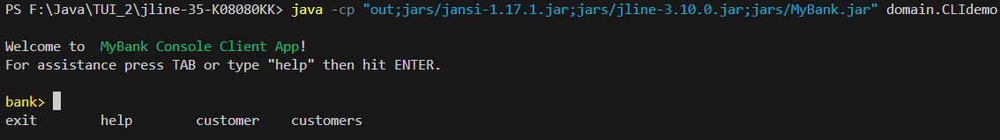
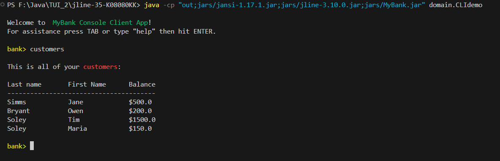
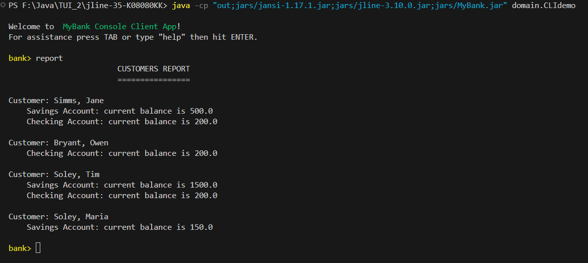

# UI Lab 2 
## jline, jansi, MyBank
### Завдання
<b>Завантажте необхідні jar-файли - jline, jansi, MyBank. Останній файл містить всі класи (Bank, Customer, Account та ін.) з наших попередніх лаб. УВАГА! Також ви можете взяти всі три файли прямо з цього ж репозиторію.
Створіть в Netbeans новий проект з назвою TUIdemo (або використайте проект, створений в ході виконання попередньої роботи). УВАГА! Чекбокс Create Main Class треба очистити (не створювати виконуваний клас)!
Додайте до проекту всі завантажені вами бібліотеки - правою кнопкой на проекті, обрати Properties, потім у дереві категорій обрати Libraries (другий пункт зверху), натиснути у правій частині вікна кнопку Add JAR/Folder, обрати jar-файли, завантажені у п. 1, натиснути Ok
Додайте до проекту файл CLIdemo.java з цього репозиторію
Вивчіть вихідний код у файлі, впевніться, що ви розумієте як він має працювати
Відкрийте консоль (під Linux - емулятор терміналу, під Windows - PowerShell), перейдіть до теки проекту (під Linux - cd NetBeansProjects/TUIDemo/dist, під Windows - cd .\Documents\NetBeansProjects\TUIdemo\dist). Запустіть проект (java -jar .\TUIdemo.jar) - ви маєте побачити запрошення (bank>). Натисніть TAB аби переглянути доступні команди. Натисніть h TAB ENTER аби переглянути довідку, cus TAB s ENTER аби переглянути список клієнтів банку, Up Backspace Space 1 ENTER аби переглянути інформацію про клієнта з номером 1, Up 2 ENTER аби впевнитись, що програма коректно обробляє неправильний номер клієнта, e TAB ENTER для виходу.</b>

### Результат

## test.dat
### Завдання
<b>Перепишіть код так, щоб інформація про клієнтів банку та їх рахунки читалась з файлу test.dat.</b>

### Результат 

## report
### Завдання
<b>Додайте ще одну команду - report, яка має виводити звіт за клієнтами такого ж виду.</b>

### Результат
